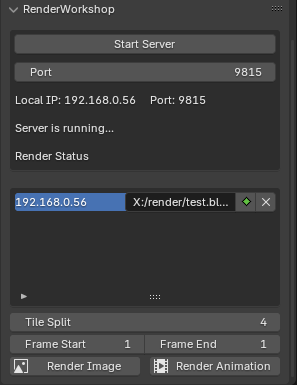
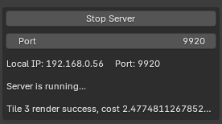
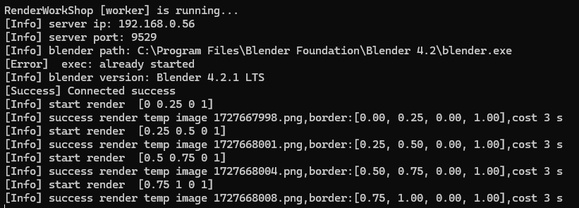

# RenderWorkshop
RenderWorkshop 是 blender 的分布式渲染工具，目前正在开发中。

[English Docs](./README.md)

如何使用
---
1.在文件-外部数据中选择打包资源，并设置好渲染内容（渲染引擎、采样率...）并保存文件
2.将blend文件放在所有worker可以访问到的共享目录上
3.使用manager的blender打开blend文件
4.在输出面板中找到RenderWorkshop，启动服务器
5.在worker上配置好config文件，并运行worker
6.manger的参数列表将会出现已连接的worker
7.在worker列表中设置他们访问blend文件的位置（比如worker1为X:/render/test.blend，worker2为Z:/render/test.blend。最好设置一个统一的网络路径，比如//192.168.0.100/render）
8.点击渲染，等待渲染结果

工作原理
---
RenderWorkshop分为manager和worker两部分。

### 对于图像
manager获取需要渲染的文件并计算区域渲染的范围（tiles），制定区域渲染的渲染任务，连接 worker 主机，并将任务分配给可用的 worker。
worker负责渲染manager分发的区域渲染任务，并在渲染完成后将任务发送给manager，然后 “领取 ”下一个任务。
图像的所有区域渲染完成后，manager会使用 blender 合成器将所有分区合并成完整的图像。

### 图像序列（视频）
图像序列渲染有两种模式
1. 您可以选择与图像相同的切片渲染模式，即每一帧都分配给所有worker进行渲染（在渲染下一帧之前，先渲染当前帧）
2. 您可以选择为不同的worker设置不同的帧范围，类似于 [Flamenco](https://flamenco.blender.org/)。

### 开发进度
 - [x] manager基本框架
 - [x] worker程序及渲染文件
 - [x] manger和worker socket通信
 - [x] manger切片及任务分发
 - [x] worker图像回传
 - [ ] manager图像接收
 - [ ] manager图像拼接及展示
 - [ ] manger自动共享blend文件（如果可行）
 - [ ] 图像序列渲染（分区渲染）
 - [ ] 图像序列渲染（多帧渲染）
 - [ ] worker文件打包可执行文件
 - [ ] worker在线状态反馈
 - [ ] 界面UI主动刷新（当前UI界面不会主动刷新，需要移动鼠标等方式进行刷新）
 - [ ] 多平台blender测试（当前基于Windows）
 - [ ] 多版本blender渲染测试（当前基于blender4.2.1）
 - [ ] 代码优化
 - [ ] 多语言支持
